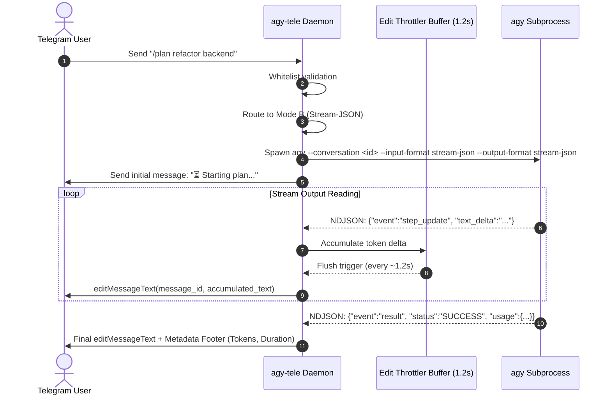

<div align="center">

# 🚀 agy-tele

**Ultra-lightweight, resource-efficient Telegram Remote Bridge for Google Antigravity CLI (`agy`)**

[](https://golang.org)
[](https://github.com)
[](https://github.com)
[](https://opensource.org/licenses/MIT)
[](#-performance--resource-budget)

*Control your local or remote Antigravity AI coding agent from anywhere using Telegram — featuring 100% slash command coverage, real-time live streaming, in-place interactive menus, and zero chat clutter.*

---

</div>

## 📑 Table of Contents
- [Why agy-tele?](#-why-agy-tele)
- [Key Features](#-key-features)
- [Architecture & Engine Design](#-architecture--engine-design)
- [Slash Command Reference](#-slash-command-reference)
- [Zero Chat Clutter UI](#-zero-chat-clutter-ui)
- [Rich Markdown & Table Formatting](#-rich-markdown--table-formatting)
- [Performance & Resource Budget](#-performance--resource-budget)
- [Quickstart (Local Testing)](#-quickstart-local-testing)
- [Production Deployment (Linux Server)](#-production-deployment-linux-server)
- [Configuration Reference](#-configuration-reference)
- [GitHub Actions & Automated Releases](#-github-actions--automated-releases)
- [Security](#-security)
- [License](#-license)

---

## 💡 Why agy-tele?

Running autonomous coding sessions or monitoring long-running agent tasks (`/plan`, `/goal`) often requires keeping an active SSH session or desktop terminal open. Traditional web/desktop remote solutions consume 300MB–1GB+ RAM and lack push notifications.

`agy-tele` solves this by bridging the **Google Antigravity CLI (`agy`)** directly into Telegram via a single, self-contained native Go binary:
- **No Node.js, Python, or Electron runtime required.**
- **Idle RAM ≤ 15 MB, Active RAM ≤ 35 MB, CPU idle ≈ 0%.**
- **Full mobile control** over prompts, file navigation, model switching, quota checking, and permissions.

---

## ✨ Key Features

- **Dual-Engine Execution**:
  - **Mode A (Fast CLI Inspection)**: Instant one-shot execution for `/usage`, `/credits`, `/skills`, `/model`, `/effort`, `/agents`, `/changelog` (<100ms return).
  - **Mode B (Stream-JSON Agent Engine)**: Continuous multi-turn coding agent, `/plan <task>`, `/goal <task>`, and skill execution with `--conversation <id>` context retention.
- **Autonomous Multi-Turn `/goal` Engine**: Executes end-to-end autonomous goals without stopping until `<!-- GOAL_COMPLETE -->` is emitted, seamlessly chaining iterations without requiring manual "Continue" prompts.
- **Concurrency & Busy-Task Protection**: Guards against race conditions and API 503 errors when multiple prompts are sent in quick succession. Displays a live status card with an instant `[ 🛑 Hentikan Tugas Aktif ]` cancellation button.
- **Unlimited Execution Watchdog (`--print-timeout 24h`)**: Eliminates the default 5m0s CLI watchdog cutoff, allowing long-running background tasks, deep reasoning, subagents, and builds to run reliably until completion.
- **Clean Process-Group Termination**: Canceling a task (`/cancel` or inline button) cleanly terminates the entire process group (SIGKILL) on Linux, ensuring no orphan child tools remain running.
- **Multimodal File & Photo Uploads**: Send photos, documents, code files, or logs directly through Telegram. They are automatically saved into the active workspace and analyzed by the agent with your custom caption.
- **Interactive Artifact Review (`/artifact`)**: Inspect generated architecture designs, specs, and plan documents directly inside Telegram with inline pagination, full previews, and instant document downloads.
- **Rich Markdown & Table Rendering**:
  - Automatically transforms standard Markdown tables into beautiful, aligned Unicode box tables (`┌─┬─┐...`) inside `<pre>` blocks, supporting smooth horizontal scrolling on mobile devices without layout breaking.
  - Full support for native Telegram 7.0+ `<blockquote>...</blockquote>` quotes and formatted horizontal dividers.
- **Intelligent Long-Text Debouncer & Multi-Part Splicer**: Automatically detects and seamlessly reconstructs long prompts or code blocks that are split by Telegram desktop/mobile clients into multiple 4096-character chunks. Features smart boundary concatenation that preserves exact code indentation and JSON syntax without inserting rogue newlines, and tracks all split chunk IDs for unified Telegram turn auto-deletion.
- **Telegram Chat Auto-Delete (`/autodelete`)**: Automatically evicts older message turns in Telegram chat when exceeding a configurable threshold (default: 50 turns; customizable: 20, 50, 100, or disabled/clean now). Keeps mobile Telegram apps fast and lag-free while keeping all server-side Antigravity transcripts and session histories 100% safe and intact.
- **Multi-Language Support (`/lang`)**: Seamless switching between Bahasa Indonesia (`id`) and English (`en`) for all interactive dashboards, status cards, progress badges, and alerts.
- **Interactive Workspace & Status Actions (`/status`)**: Interactive status dashboard with instant mobile tactile toast feedback, quick directory file browsing (`[ 📁 List File (/ls) ]`), and in-place refresh.
- **Throttled Zero-Flicker Streaming**: Live streaming with token delta throttling (1200ms) and in-place status adoption (`AdoptMessageID`), eliminating chat jitter and avoiding Telegram API `HTTP 429`.
- **Zero Chat Clutter (In-Place UI)**: Interactive dashboards and configuration menus edit in-place and include `[ 🗑️ Tutup ]` instant dismissal buttons.
- **Auto-Sanitasi Link Path Lokal**: Automatically converts internal Antigravity `[`path`](file:///path)` links into crisp, monospaced code badges (`<code>path</code>`).
- **Interactive Multi-Account Google OAuth Management (`/accounts`, `/login`, `/signout`)**:
  - Seamlessly switch between multiple Google accounts with 1-click inline buttons without re-opening a browser or re-authorizing every time.
  - Automatically archives tokens in `~/.gemini/antigravity-cli/accounts/<email>.json` upon logout or account switch.
  - Interactive OAuth 2.0 consumer login bridge powered by a virtual pseudo-terminal (PTY), displaying direct Google authorization links and accepting codes or raw redirect callback URLs.
  - Informative error handling and automatic recovery for invalid or expired OAuth codes.
- **Single-Tenant Security**: Whitelists authorized Telegram User IDs (`allowed_user_ids`). Unauthenticated users are completely blocked.

---

## 🏗️ Architecture & Engine Design

```
                      ┌──────────────────────────────────────────────┐
                      │            Telegram Bot User Input           │
                      └──────────────────────┬───────────────────────┘
                                             │
                        Is CLI Command or Agent Task?
                                             │
                    ┌────────────────────────┴────────────────────────┐
                    ▼                                                 ▼
     [Mode A: Fast CLI Inspector]                   [Mode B: Stream-JSON Agent]
     • Commands: /usage, /credits, /skills,         • Commands: /plan, /goal, prompts,
       /model, /effort, /changelog, /help             interactive code generation.
     • Invocation:                                  • Invocation:
       agy -p "<command>"                             agy --input-format stream-json
     • Behavior: Instant stdout capture;              --output-format stream-json
       fast return; 0 state overhead.                 --conversation <conv_id>
                                                    • Protocol: NDJSON stream over
                                                      stdin/stdout (init, step_update,
                                                      result, error)
```



---

## 📋 Slash Command Reference

### 🤖 Agent & Coding (Mode B)
| Command | Description |
| :--- | :--- |
| `Plain Text Prompt` | Dispatches coding prompt or conversational instruction to the agent. |
| `File / Photo / Doc` | Uploads file/image into workspace and triggers agent inspection with optional caption. |
| `/plan <task>` | Initiates in-depth planning mode (`--mode plan`) with structured milestone breakdown. |
| `/goal <task>` | Runs an autonomous, long-running goal with progress milestones. |
| `/continue` | Continues the previous conversation session seamlessly (`--continue`). |
| `/cancel`, `/stop` | Immediately interrupts and kills the running `agy` subprocess on the server. |

### 📊 CLI Quota & Status (Mode A)
| Command | Description |
| :--- | :--- |
| `/usage`, `/quota` | Real-time 5-hour and weekly quota usage table (Gemini & Claude/GPT models). |
| `/credits` | Displays current G1 credit balance. |
| `/model [name\|reset]` | Shows active model, presents an interactive picker, or resets to default (`/model reset`). |
| `/effort [level]` | Sets reasoning effort (`low`, `medium`, `high`). |
| `/skills` | Lists all installed Antigravity skills with descriptions. |
| `/agents` | Lists available custom subagents. |
| `/changelog` | Displays recent release notes and changes. |

### 👤 Google Account Management
| Command | Description |
| :--- | :--- |
| `/accounts` | Interactive dashboard to view, switch, or remove saved Google accounts with 1-click buttons. |
| `/login`, `/signin` | Initiates OAuth 2.0 authorization, returning a Google login link and waiting for authorization code. |
| `/signout`, `/logout` | Signs out of the current Google account and safely archives it to saved accounts. |
| `/whoami` | Shows full profile details (email, name, auth method, token expiry) of the active account. |
| `/code <code>` | Submits the OAuth authorization code or full callback URL to complete login. |

### 📂 Workspace, Artifacts & Session Navigation
| Command | Description |
| :--- | :--- |
| `/cwd [path]` | Gets or changes the active working directory (defaults to `/` on Linux, `C:\` on Windows). |
| `/pwd` | Prints the active working directory. |
| `/ls [path]` | Lists files and directories in the target path. |
| `/new [path]` | Resets the conversation session (optionally in a new workspace path). |
| `/resume [id]` | Interactively browses and resumes past sessions by topic title, timestamp, and workspace. |
| `/sessions` | Lists previous conversation IDs with timestamps for fast context switching. |
| `/switch <id\|email>` | Switches active context to a specific conversation ID or saved Google account email. |
| `/artifact`, `/artifacts` | Opens interactive browser for generated plans, architecture designs, and documents. |
| `/permission [auto\|ask]` | Toggles tool permissions: `auto` (hands-free) or `ask` (manual confirmation). |
| `/status` | Displays full runtime daemon state, active Google account, workspace, active model, and permission mode. |
| `/autodelete [limit]` | Configures auto-deletion limit for Telegram messages (`20`, `50`, `100`, `off`, or `clean`). |
| `/lang [id\|en]` | Switches interface language between Bahasa Indonesia (`id`) and English (`en`). |
| `/file <path>` | Sends a file from the server workspace directly as a Telegram document. |

---

## 🧹 Zero Chat Clutter UI

Unlike ordinary Telegram bots that flood your chat with new messages for every button press:
1. **In-Place Navigation**: Clicking menu buttons (**📊 Quota**, **🧠 Ganti Model**, **⚡ Set Effort**, **🧰 Skills**, **🔄 Sesi Baru**) updates the **same message in-place** without spawning extra messages.
2. **Instant Dismissal (`[ 🗑️ Tutup ]`)**: Every status, directory, and quota card contains a close button that **instantly deletes the message** from chat history.
3. **In-Place Refresh (`[ 🔄 Refresh ]`)**: Refresh live quotas and statuses directly on the active card.

---

## 🎨 Rich Markdown & Table Formatting

Telegram Bot API does not natively support HTML `<table>` tags. `agy-tele` includes a built-in markdown parser and formatter that transforms LLM output into elegant mobile-ready components:

1. **Monospace Unicode Box Tables**:
   Markdown tables are parsed, auto-padded to exact column character widths, and wrapped inside `<pre>` blocks using Unicode box-drawing glyphs. On mobile Telegram apps, these tables retain their columnar alignment and support smooth horizontal scrolling:
   ```text
   ┌──────┬─────────┬──────────────────┬──────────────┬──────────────────────┐
   │ Tipe │ Total   │ Digunakan (Used) │ Bebas (Free) │ Tersedia (Available) │
   ├──────┼─────────┼──────────────────┼──────────────┼──────────────────────┤
   │ RAM  │ 1.9 GiB │ 910 MiB          │ 506 MiB      │ 1.0 GiB              │
   │ Swap │ 4.0 GiB │ 17 MiB           │ 4.0 GiB      │ -                    │
   └──────┴─────────┴──────────────────┴──────────────┴──────────────────────┘
   ```
2. **Native Blockquotes (`<blockquote>`)**: Lines starting with `> ` are converted into Telegram 7.0+ native blockquotes featuring an accent vertical line.
3. **Sanitized Links & Dividers**: File links (`file:///...`) are converted to clean code chips, and markdown rules (`---`) become neat dividers.

---

## ⚡ Performance & Resource Budget

| Metric | Target Budget | Actual Observed |
| :--- | :--- | :--- |
| **Idle Memory (RAM)** | ≤ 15 MB | ~14.2 MB |
| **Active Streaming RAM** | ≤ 35 MB | ~28.5 MB |
| **Idle CPU** | ≈ 0.0% | 0.0% (Long polling) |
| **Compiled Binary Size** | < 15 MB | **~6.5 MB** (Linux AMD64), **~9.5 MB** (Windows) |
| **External Dependencies** | Zero | Pure Go statically linked |

---

## 🚀 Quickstart (Local Testing)

### 1. Clone & Build
```bash
git clone https://github.com/f4rdani/antigravity-telegram.git
cd antigravity-telegram
go build -ldflags="-s -w" -o bin/agy-tele ./cmd/agy-tele
```

### 2. Configure
Copy `config.example.json` to `config.json`:
```json
{
  "telegram": {
    "bot_token": "YOUR_TELEGRAM_BOT_TOKEN",
    "allowed_user_ids": [123456789],
    "stream_edit_interval_ms": 1200
  },
  "agy": {
    "binary_path": "agy",
    "default_workspace": "auto",
    "default_model": "",
    "default_effort": "",
    "permission_mode": "auto"
  },
  "storage": {
    "session_file": "./sessions.json"
  }
}
```

> **Tips**:
> - Get your `bot_token` from [@BotFather](https://t.me/botfather).
> - Get your Telegram User ID from [@userinfobot](https://t.me/userinfobot).

### 3. Run
```bash
# On Windows:
.\bin\agy-tele.exe -config config.json

# On Linux / macOS:
./bin/agy-tele -config config.json
```

---

## 🐧 Production Deployment (Linux Server)

### 1. Upload Binary & Configuration
Pre-built Linux binaries are available in [Releases](https://github.com/f4rdani/antigravity-telegram/releases) or can be cross-compiled with `make linux`.

```bash
sudo mkdir -p /opt/agy-tele
sudo cp bin/agy-tele-linux-amd64 /opt/agy-tele/agy-tele
sudo cp config.json /opt/agy-tele/config.json
sudo chmod +x /opt/agy-tele/agy-tele
```

### 2. Configure Systemd Service
Copy `service/agy-tele.service` to `/etc/systemd/system/agy-tele.service`:

```ini
[Unit]
Description=Antigravity CLI Telegram Remote Bridge Daemon
After=network.target

[Service]
Type=simple
User=root
WorkingDirectory=/opt/agy-tele
ExecStart=/opt/agy-tele/agy-tele -config /opt/agy-tele/config.json
Restart=always
RestartSec=5s
Environment="PATH=/usr/local/bin:/usr/bin:/bin"
LimitNOFILE=65535

[Install]
WantedBy=multi-user.target
```

### 3. Start Service
```bash
sudo systemctl daemon-reload
sudo systemctl enable agy-tele
sudo systemctl start agy-tele
sudo systemctl status agy-tele
```

To follow logs in real time:
```bash
journalctl -u agy-tele -f
```

---

## ⚙️ Configuration Reference

Configuration can be supplied via `config.json` or Environment Variables:

| JSON Key | Environment Variable | Default | Description |
| :--- | :--- | :--- | :--- |
| `telegram.bot_token` | `TELEGRAM_BOT_TOKEN` | `""` | Telegram Bot Token from BotFather |
| `telegram.allowed_user_ids` | `ALLOWED_USER_IDS` | `[]` | Comma-separated list of whitelisted user IDs |
| `telegram.stream_edit_interval_ms` | `STREAM_EDIT_INTERVAL_MS` | `1200` | Stream edit throttle window in milliseconds |
| `agy.binary_path` | `AGY_BINARY_PATH` | `"agy"` | Path to Antigravity CLI executable |
| `agy.default_workspace` | `AGY_DEFAULT_WORKSPACE` | `"auto"` | Default root directory (`/` on Linux, `C:\` on Windows) |
| `agy.permission_mode` | `AGY_PERMISSION_MODE` | `"auto"` | Tool permissions mode (`auto` or `ask`) |
| `agy.print_timeout` | `AGY_PRINT_TIMEOUT` | `"24h"` | Stream execution timeout duration (e.g. `"24h"`) |
| `storage.session_file` | `STORAGE_SESSION_FILE` | `"./sessions.json"` | Path to session storage file |

---

## 📦 GitHub Actions & Automated Releases

This repository includes an automated GitHub Actions workflow (`.github/workflows/release.yml`) for cross-compilation and automated releases.

To release a new version:
```bash
# 1. Tag your commit
git tag v1.0.0

# 2. Push tag to GitHub
git push origin v1.0.0
```

GitHub Actions will automatically:
1. Run lint and unit tests.
2. Cross-compile optimized binaries for:
   - `linux/amd64`
   - `linux/arm64`
   - `windows/amd64`
   - `darwin/amd64` (macOS Intel)
   - `darwin/arm64` (macOS Apple Silicon)
3. Package `.tar.gz` and `.zip` archives with SHA-256 checksums (`checksums.txt`).
4. Publish a official GitHub Release.

---

## 🔒 Security

- **Strict User Whitelist**: Only Telegram User IDs explicitly listed in `allowed_user_ids` can interact with the bot. Unauthorized messages receive a rejection notice and are logged.
- **Sensitive Secrets**: Never commit `config.json` or `sessions.json` to public repositories. Both are included in `.gitignore` by default.

---

## 📄 License

This project is licensed under the [MIT License](LICENSE).
